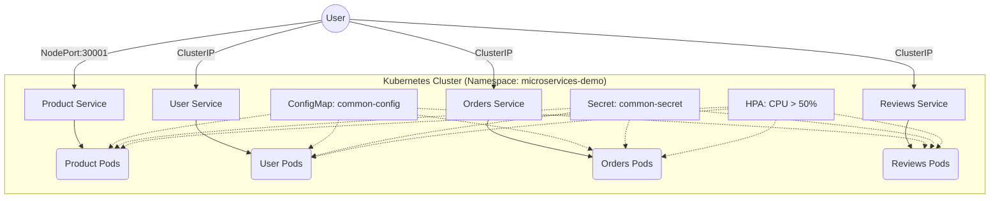

# Kubernetes Deployment for E-commerce Microservices

This directory contains the Kubernetes manifests required to deploy the microservices-based e-commerce application. The deployment utilizes standard Kubernetes resources including Deployments, Services, ConfigMaps, Secrets, and Horizontal Pod Autoscalers (HPA).

## 🏗 Architecture

The application consists of four microservices deployed in the `microservices-demo` namespace.



## 📋 Prerequisites

- **Kubernetes Cluster**: A running cluster (Minikube, Kind, Docker Desktop, or Cloud Provider).
- **kubectl**: Command-line tool configured to communicate with your cluster.
- **Docker Images**: The service images (`product-service`, `user-service`, `orders-service`, `reviews-service`) must be available in your cluster's registry.
    - *Note: If using Minikube/Kind, ensure you build or load images into the cluster's docker daemon.*

## ⚙️ Configuration

### 1. Namespace & Shared Resources
Defined in `00-namespace-config-secrets.yaml`.

- **Namespace**: `microservices-demo`
- **ConfigMap** (`common-config`):
  - `FLASK_ENV`: "production"
  - `PYTHONUNBUFFERED`: "1"
  - Service Ports: 5001-5004
- **Secret** (`common-secret`):
  - `SECRET_KEY`: Application secret key (Base64 encoded in cluster).

### 2. Services Overview

| Service | Internal Port | ClusterIP | NodePort | Replicas (Min/Max) |
|---------|---------------|-----------|----------|-------------------|
| **Product** | 5001 | Yes | 30001 | 1 / 5 |
| **User** | 5002 | Yes | - | 1 / 5 |
| **Orders** | 5003 | Yes | - | 1 / 5 |
| **Reviews** | 5004 | Yes | - | 1 / 5 |

### 3. Resource Limits & Probes
All services are configured with the following resource constraints and health checks:

- **Resources**:
  - Requests: `cpu: 100m`, `memory: 128Mi`
  - Limits: `cpu: 500m`, `memory: 256Mi`
- **Liveness Probe**: Checks `/health` every 20s (initial delay 30s).
- **Readiness Probe**: Checks `/health` every 10s (initial delay 10s).

## 🚀 Deployment Steps

### Step 1: Apply Base Configuration
Create the namespace, config maps, and secrets.

```bash
kubectl apply -f 00-namespace-config-secrets.yaml
```

### Step 2: Deploy Microservices
Deploy the application workloads.

```bash
kubectl apply -f product-service.yaml
kubectl apply -f user-service.yaml
kubectl apply -f orders-service.yaml
kubectl apply -f reviews-service.yaml
```

### Step 3: Expose Services
Expose the Product Service externally using NodePort.

```bash
kubectl apply -f product-service-nodeport.yaml
```

### Step 4: Enable Autoscaling
Apply Horizontal Pod Autoscalers.

```bash
kubectl apply -f hpa.yaml
```

## ✅ Verification

1. **Check Pod Status**:
   Ensure all pods are `Running` and ready.
   ```bash
   kubectl get pods -n microservices-demo
   ```

2. **Check Services**:
   Verify IP addresses and ports.
   ```bash
   kubectl get svc -n microservices-demo
   ```

3. **Access the Application**:
   - **Minikube**: `minikube service product-service-nodeport -n microservices-demo`
   - **Docker Desktop/Localhost**: `http://localhost:30001/products`

   Test with curl:
   ```bash
   curl http://localhost:30001/products
   ```

## 📈 Autoscaling (HPA)

The HPA is configured to scale pods between **1 and 5 replicas** based on CPU utilization.
- **Trigger**: Average CPU utilization > 50%.
- **Check HPA Status**:
  ```bash
  kubectl get hpa -n microservices-demo
  ```

## 🛠 Troubleshooting

- **Pods Pending**: Check if nodes have enough resources (CPU/Memory) or if a PersistentVolume is missing (not applicable here as we use stateless deployments).
- **ImagePullBackOff**: Ensure images are built and available locally or in the registry.
  - For Minikube: `eval $(minikube docker-env) && docker compose build`
- **Service Unavailable**: Check endpoints.
  ```bash
  kubectl get endpoints -n microservices-demo
  ```

## 🧹 Cleanup

To remove all resources created by this deployment:

```bash
kubectl delete namespace microservices-demo
```
